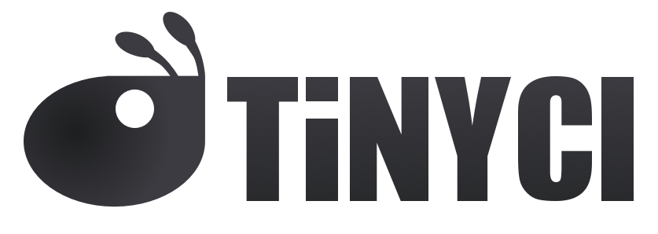

# tinyCI: a parallel CI system built on GRPC, swagger, and replaceable microservices

tinyCI is a comprehensive CI solution for nearly any situation using its
extensible design around the GRPC and swagger 2.0 ecosystems. This design
allows any service in the system to be trivially replaced with a personally
customized or supported replacement that does what you need. This design has no
limitations: From programming frameworks to data center architectures, anything
can be supported by tinyCI if you're willing to code it.

tinyCI's control plane is secured (optionally) by client/server TLS
authentication.

tinyCI's github integration is fully compatible with [Github
Flow](https://guides.github.com/introduction/flow/); OAuth support for the
entire UI toolchain through it. [Github
Checks](https://developer.github.com/v3/checks/) support is on the way, but for
now you can leverage our auto-configuration of hooks and rich status interface.

tinyCI is a parallel tester that leverages the notion of "diff selection" and a
task hierarchy that allows your diffs to drive what tests run in your pull
request. On master merges the full suite is run, however. A central tenet of
tinyCI is to stimulate developers to work harder by allowing quicker feedback
through the use of parallelism and shorter test cycles. See the
[documentation](https://docs.tinyci.org) for more information.

tinyCI's UI is quite advanced, with full xterm log support, runner health
metrics, and a modern react-driven process leveraging [Material
UI](http://material-ui.com), we are able to achieve the best experience
available. And if you don't like it, replace it! It's backed entirely by
microservices! We also have a CLI client for those of you who prefer that.

## Docs

[Please check our documentation out!](https://docs.tinyci.org) It contains tons
of information on how to demo, install, leverage and further power the system,
as well as architecture plans and all sorts of stuff!

## Authors/Contributors

tinyCI is faithfully maintained by the following people:

- [Erik Hollensbe](https://github.com/erikh) (Core design and Architecture)
- [Josiah Kiehl](https://github.com/capoferro) (UI/React and microservices design)
- [Eric Zhu](https://github.com/invisiblehermit) (UI/Artwork and Documentation site)
- [Cristian Staretu](https://github.com/unclejack) (Demo, Installer, and operations toolchain)

and.. you! :D We happily accept open contributions.

## License

Mozilla Public License 2.0: https://www.mozilla.org/en-US/MPL/2.0/
